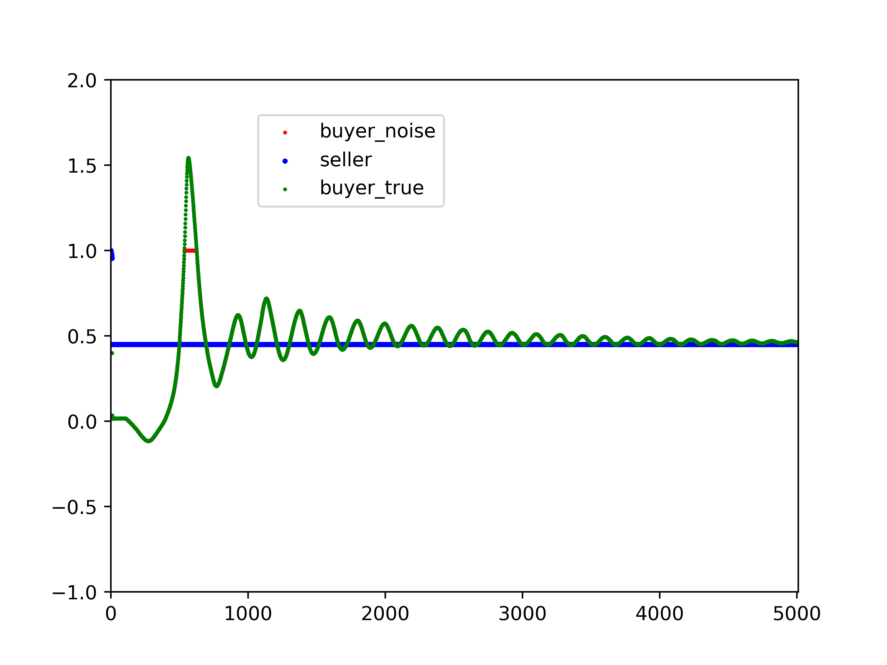

# Code Folder 

First, download the project via git, and switch to the `code/` folder
```bash
git clone https://github.com/Shanshan-Huang/Monte-Carlo-Masters.git`
# change working directory to the current folder 
cd code
```
All necessary dependencies are written in file `requirements.txt`, for a quick glance, they include the following \
python 3.7 \
numpy \
pandas \
matplotlib \
tensorflow \
gym \
tf (1.14.0) would probably see some warninig, but it's okay \
scipy \
time

We recommend create a conda environment `ddpg` to install all necessary packages for this project, so that in the end you could easily remove everything by deleting the whole enviroment.
```bash
# create an virtual environment with python version 3.7 
conda create -n ddpg python=3.7
# activate environment 
conda activate ddpg
# install all dependencies
pip install --user --requirement requirements.txt
```

Sample commands to run the code is provided as following
```
python ddpg_combine_reward.py --reward_mode=1 --his_len=1 --noise=0
```
You can switch to different reward function by adjusting the `reward_mode`, set the number of historical length by setting  `his_len`, set `noise` level to a positive number to allow exploration. 

The reward function is plotted below, there are in total four different rewards to choose from.
<!--  -->


It will output the accumulated reward as well as a picture in format `mode_x_hislen_x_var_x.png` with corresponding configuration decided in input argument. A sample image would be following.


